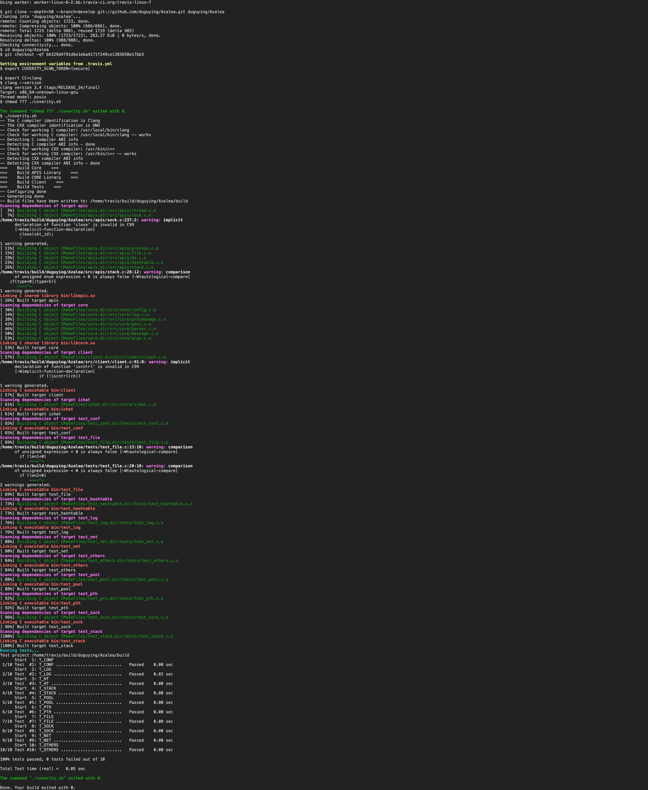

# ansiparser with xlog

this is an ansiparser named xlog, it could generate ansi colorful log in browser with DOM.

## Install

```shell
npm install xlog-ansiparser --save
```

## Usage

```html
<!DOCTYPE html>
<html lang="en">
<head>
    <meta charset="UTF-8">
    <title>Title</title>
    <script src="./node_modules/jquery/dist/jquery.js"></script>
    <script src="./dist/xlog-1.0.0.js"></script>
    <link rel="stylesheet" href="./xlog.css">
    <style>
        body{
            margin: 0;
        }
    </style>
</head>
<body>
<pre id="xlog" class="dark">
</pre>
</body>
<script>
    var container = document.getElementById("xlog")
    var lexer = new XLog(container)

    $(document).ready(function (e) {
        $.ajax({
            method: "GET",
            url: "https://api.travis-ci.org/v3/job/31095019/log.txt",
            success: function (data) {
                let segs = data.split("\n");
                segs.forEach((v, i) => {
                    setTimeout(() => {
                        let substr = v;
                        if (segs.length !== i + 1) {
                            substr = substr + "\n"
                        }
                        lexer.write(substr)
                    }, 0)
                })
            }
        })
    });
</script>
</html>
```

## Screen shot



## How to build

this project based on webpack, building as following

```shell
npm install
npm run build
```

and the artifacts will be in `dist` directory.

## License

MIT License
